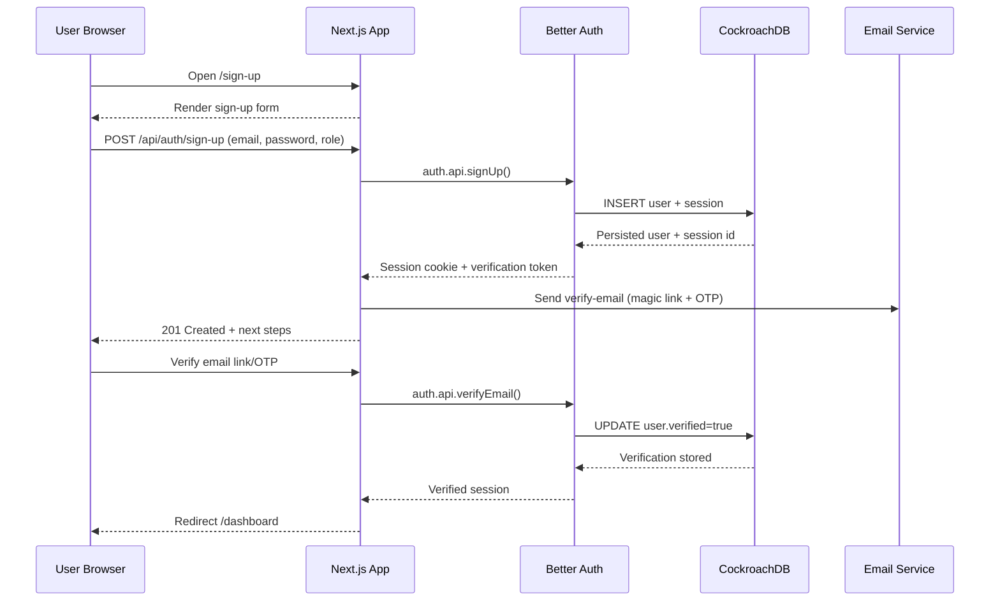
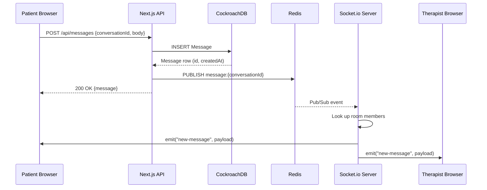
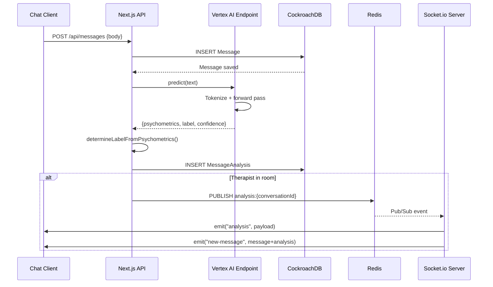

# Sequence Diagrams

## User Registration

```mermaid
sequenceDiagram
    participant U as User Browser
    participant N as Next.js App
    participant A as Better Auth
    participant D as CockroachDB
    participant E as Email Service

    U->>N: Open /sign-up
    N-->>U: Render sign-up form

    U->>N: POST /api/auth/sign-up (email, password, role)
    N->>A: auth.api.signUp()
    A->>D: INSERT user + session
    D-->>A: Persisted user + session id
    A-->>N: Session cookie + verification token
    N->>E: Send verify-email (magic link + OTP)
    N-->>U: 201 Created + next steps

    U->>N: Verify email link/OTP
    N->>A: auth.api.verifyEmail()
    A->>D: UPDATE user.verified=true
    D-->>A: Verification stored
    A-->>N: Verified session
    N-->>U: Redirect /dashboard
```

## Message Flow

```mermaid
sequenceDiagram
    participant P as Patient Browser
    participant N as Next.js API
    participant DB as CockroachDB
    participant R as Redis
    participant S as Socket.io Server
    participant T as Therapist Browser

    P->>N: POST /api/messages {conversationId, body}
    N->>DB: INSERT Message
    DB-->>N: Message row (id, createdAt)
    N->>R: PUBLISH message:{conversationId}
    N-->>P: 200 OK {message}

    R-->>S: Pub/Sub event
    S->>S: Look up room members
    S->>P: emit("new-message", payload)
    S->>T: emit("new-message", payload)
```

## ML Inference

```mermaid
sequenceDiagram
    participant C as Chat Client
    participant N as Next.js API
    participant V as Vertex AI Endpoint
    participant DB as CockroachDB
    participant R as Redis
    participant S as Socket.io Server

    C->>N: POST /api/messages {body}
    N->>DB: INSERT Message
    DB-->>N: Message saved

    N->>V: predict(text)
    V->>V: Tokenize + forward pass
    V-->>N: {psychometrics, label, confidence}
    N->>N: determineLabelFromPsychometrics()
    N->>DB: INSERT MessageAnalysis

    alt Therapist in room
        N->>R: PUBLISH analysis:{conversationId}
        R-->>S: Pub/Sub event
        S->>C: emit("analysis", payload)
        S->>C: emit("new-message", message+analysis)
    end
```
